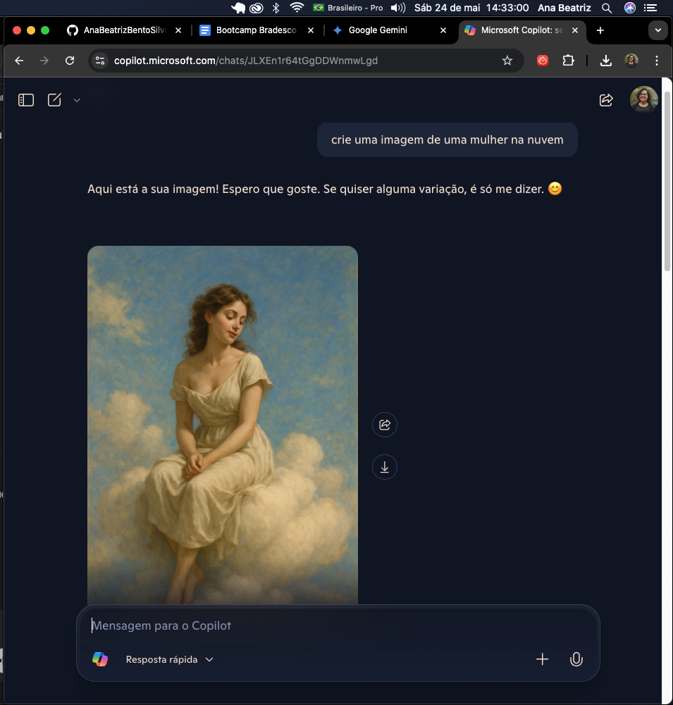
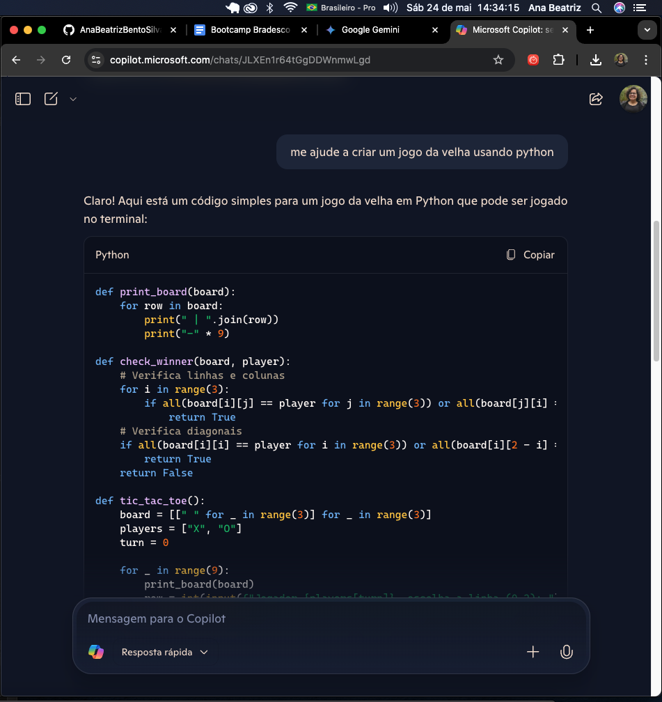
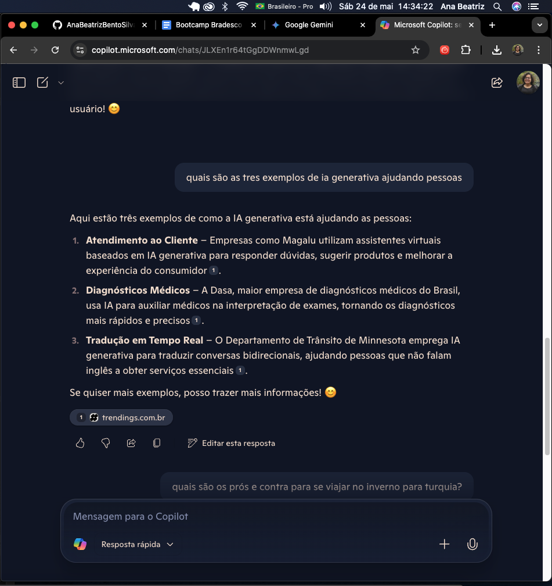
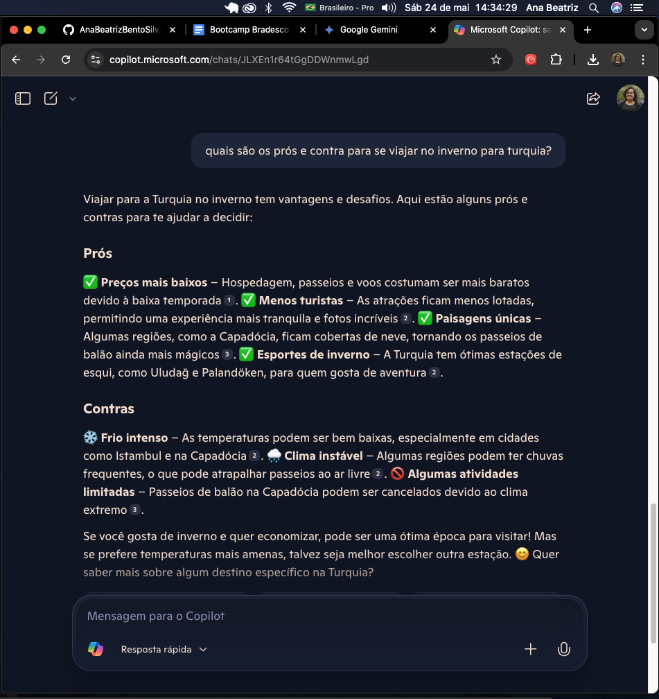

# Laboratório - Explorando IA Generativa com Microsoft Copilot e OpenAI

## Entendendo o Desafio

Este laboratório faz parte do desafio proposto pela DIO, que visa desenvolver um perfil de destaque explorando conceitos abordados nas aulas sobre inteligência artificial generativa, Copilot e OpenAI. O objetivo principal é aplicar na prática os conhecimentos adquiridos, documentando de forma clara e organizada a experiência de uso dessas ferramentas.

## 💡 Perguntas feitas à IA Generativa

Durante o laboratório, realizei diversas interações com a IA para explorar suas funcionalidades, que são apresentadas abaixo junto das capturas de tela correspondentes.

### 1. Criação de imagem

**Pergunta:** Pedi para a IA gerar uma imagem de uma mulher na nuvem.

🖼️ Print da interação:  

---

### 2. Auxílio para código em Python

**Pergunta:** Solicitei ajuda para criar um jogo da velha utilizando Python.

🖼️ Print da interação:  

---

### 3. Exemplos de IA generativa ajudando pessoas

**Pergunta:** Perguntei quais são três exemplos de IA generativa que auxiliam pessoas no dia a dia.

🖼️ Print da interação:  

---

### 4. Prós e contras de viajar no inverno para a Turquia

**Pergunta:** Questionei quais são os prós e contras para viajar no inverno para a Turquia.

🖼️ Print da interação:  

---

## 📚 Aprendizados e Considerações Finais

Com este laboratório, pude explorar diferentes aplicações práticas de IA generativa e Copilot, entendendo como prompts simples e objetivos geram resultados úteis em criação de imagens, suporte a programação, respostas informativas e até dicas de viagem. A documentação detalhada e organização dos recursos no GitHub ajudam a consolidar o conhecimento e compartilhar a experiência de forma profissional.

---

## 🛠️ Tecnologias Utilizadas

- Microsoft Azure (Copilot, OpenAI)
